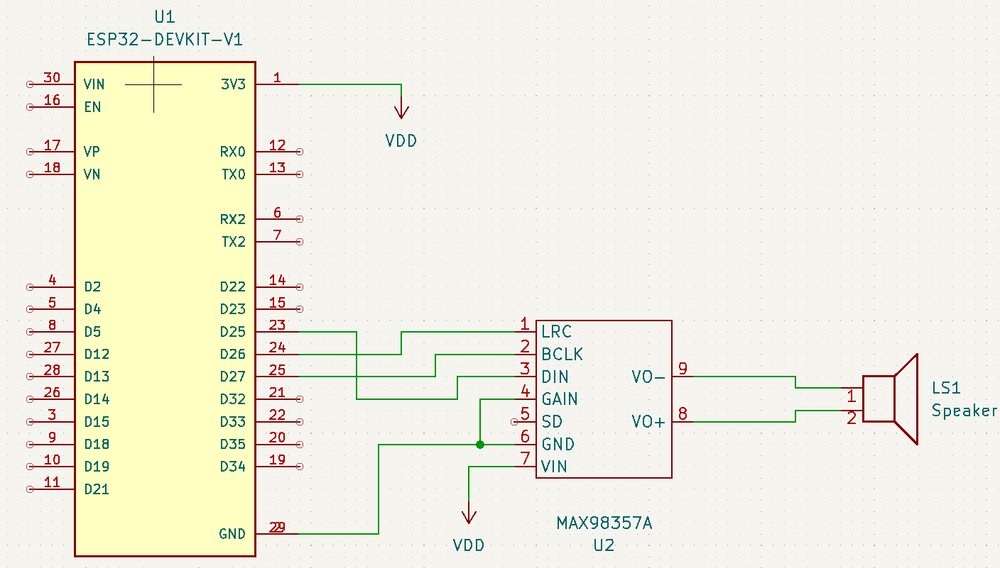
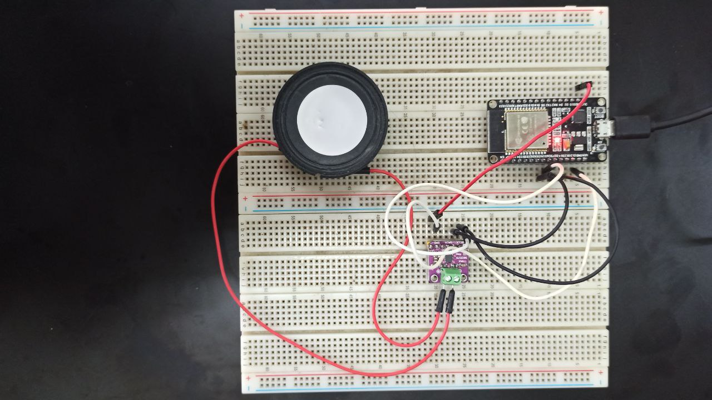

# Advanced Microcontroller Based Systems

## Table of Contents
1. [A short summary](#advanced-microcontroller-based-systems)
2. [Schematic and 3D Design](#schematic-and-3d-design)
    1. [Schematic](#schematic)
    2. [3D Design](#3d-design)

This project aims to create an ESP-IDF Audio Player using Internet Radio. The main project is located in the [**using_arduino_package**](/tree/main/using_arduino_package) folder, which adds the Arduino package to the ESP-IDF component, allowing coding with the Arduino approach.

Currently, I am in the process of constructing a web radio using ESP-IDF not incorporating ESP-ADF. The procedure is laid out as follows:

1. Construct a client-to-server relationship (access point/router)
2. Putting together the I2S interface
3. Establish an internet streaming link to the host
4. Broadcasting audio (internet streaming) by way of the I2S protocol to the audio system
5. Preserve the web streaming audio connection intact.

The instructions for step 1 can be found in the [**connect_wifi_v1**](https://github.com/azkahariz/SBML/tree/main/connect_wifi_v1), while the instructions for step 2 can be found in the [**build-project-01**](https://github.com/azkahariz/SBML/tree/main/build-project-01). For step 4, the preliminary result is that the ESP-IDF can generate the desired sound, such as a chicken alarm sound. This can then be developed so that the ESP-IDF can output streaming audio. The results can be viewed in the [**SPIFFS**](https://github.com/azkahariz/SBML/tree/main/SPIFFS).

# Schematic and 3D Design
This section will explain the schematic and 3D design employed.
## Schematic

In this project, the **ESP32 Devkit V1**, **MAX98357A**, and **8 Ohm speakers** were utilized. The ESP32 Devkit V1 is used to manage the MAX98357A and 8 Ohm speakers. The MAX98357A transforms digital signals into analog signals, while the 8 Ohm speakers are employed to play audio signals.

A schematic was created and assembled on a breadboard as illustrated below.

## 3D Design

The schematic design can be used to create a circuit board, as illustrated in the image below. The components are placed in specific positions and the copper circuit paths are established.

The image below illustrates the 3D design view of the circuit board, featuring the front view, side view, and top view.

 

 
